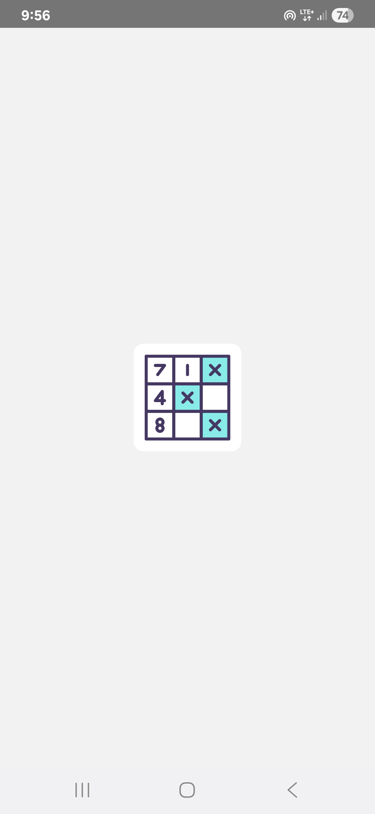
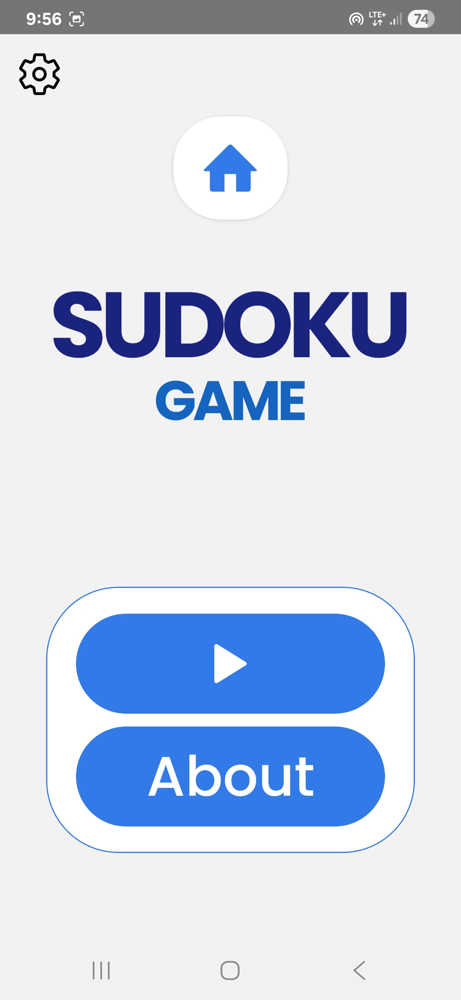
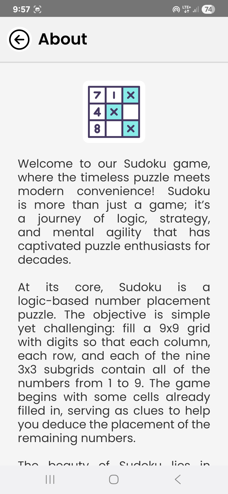

# Sudoku - React Native

A modern, clean, and engaging mobile Sudoku app designed for both Android and iOS devices. Enjoy the timeless puzzle game with a user-friendly interface and customizable features.

## Table of Contents
- [About the App](#about-the-app)
- [Screens Overview](#screens-overview)
- [Features](#features)
- [How to Play](#how-to-play)
- [Contributing](#contributing)
- [Download & Try the App](#contributing)
- [Game Screenshots](#contributing)
- [License](#license)

## About the App

Sudoku is a classic logic-based number puzzle played on a 9×9 grid, divided into nine 3×3 sub-boxes. The objective is to fill the empty cells with numbers from 1 to 9 so that each number appears only once in each row, each column, and each of the nine 3×3 boxes.

Our Sudoku app brings this timeless puzzle to your mobile device with a smooth and polished experience. It's designed for players of all skill levels, from beginners who need a little help to experts looking for a true challenge.

## Screens Overview

* **Splash Screen**: The initial screen that appears on app launch.
* **Home Screen**: Features the app logo and provides options to **Play** or learn **About** the app. The Settings button is also located here.
* **About Screen**: A brief description of the Sudoku puzzle and its rules.
* **Help & Guidelines Screen**: Detailed information about the app's features and an overview of the Game Screen controls.
* **Difficulty Selection Screen**: A simple menu to choose your preferred challenge level.
* **Game Screen**: The main gameplay area with the Sudoku grid, number input bar, and a toolbar for game controls.
* **Settings Screen**: A comprehensive menu with toggles to customize your gameplay experience.

## Features

* **Multiple Difficulty Levels**: Choose from **Easy**, **Medium**, **Hard**, and **Expert** to match your skill level.
* **Intuitive Interface**: Simple and clean design with user-friendly controls.
* **Helpful Hints**: Use the "Hint" feature to get a little help when you're stuck.
* **Customizable Gameplay**:
    * **Dark Theme Toggle**: Switch between light and dark themes for comfortable play in any environment.
    * **Customizable Settings**: Adjust margins, turn the timer on/off, enable haptic feedback (vibrate), and set limits for mistakes and hints.
* **Smart Highlighting**:
    * **Mistake Highlighting**: Incorrect entries are clearly marked in red.
    * **Region Highlighting**: Tap a cell to automatically highlight its row, column, and 3x3 box.
    * **Same Number Highlighting**: Select a number to highlight all its instances on the board.
* **Engaging Animations**: Enjoy celebratory animations when you complete a row, a column, a 3x3 box, or the entire puzzle.
* **Game Controls**: Easily **Undo**, **Erase**, **Pause**, and **Restart** your game at any time.

## How to Play

1.  **Launch the App**: The app starts with a smooth splash screen before landing on the Home Screen.
2.  **Select Difficulty**: Tap the **Play** button and choose your desired difficulty from Easy, Medium, Hard, or Expert.
3.  **Fill the Grid**: Tap an empty cell on the 9×9 grid. Use the number bar (1-9) at the bottom to enter your choice.
4.  **Complete the Puzzle**: Continue filling the grid, ensuring each number from 1 to 9 appears only once per row, column, and 3x3 box.
5.  **Use Tools**:
    * Need a hint? Tap the **Hint** icon.
    * Made a mistake? Tap the **Undo** icon to reverse your last move or the **Erase** icon to clear a number.
    * Need a break? Tap the **Pause** icon.
6.  **Customize Your Experience**: Access the **Settings** from the gear icon on the Home Screen to adjust your game settings.

## Contributing

We welcome feedback and suggestions to improve the app. Please use the "Feedback" option in the Settings menu to share your thoughts.

##  Download & Try the App

You can try out the Sudoku app by downloading the APK from the link below:
👉 [Download Sudoku APK](https://drive.google.com/file/d/1z29eSwf4rLMKi9d1MapluNqabj0fWasl/view?usp=sharing)

##  Game Screenshots

  
  
  

## License

This project is licensed under the [MIT License](https://opensource.org/licenses/MIT).